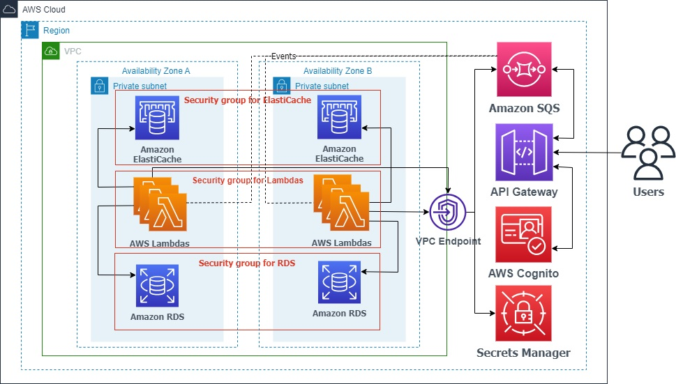

# Serverless Utilities Billing Microservice

This large-scale application, a serverless utilities billing microservice, is designed on AWS with the primary aim of facilitating online payment for utilities such as gas, water, and electricity. The backend is built using the following AWS technologies: [Amazon API Gateway](https://aws.amazon.com/api-gateway/), [AWS Lambda](https://aws.amazon.com/lambda/), [Amazon Cognito](https://aws.amazon.com/cognito/), [Amazon RDS](https://aws.amazon.com/rds/), [Amazon SQS](https://aws.amazon.com/sqs/), [Amazon ElastiCache for Redis](https://aws.amazon.com/elasticache/redis/) and [AWS Secrets Manager](https://aws.amazon.com/secrets-manager/).

The client conveniently interacts with the serverless app through an API Gateway REST API. The integration of API Gateway with SQS enables users to send request messages and receive response messages from SQS via the API Gateway.

This app utilizes an event-driven architecture where users interact with AWS Lambdas following a Request-Response pattern: user messages are first stored in an SQS queue, which subsequently triggers AWS Lambdas for asynchronous processing, and the resulting responses are sent to individual user-specific queues. Modifying the number of AWS Lambdas is straightforward, making it easy to customize the app's performance for varying workloads.

In order to uphold ACID properties, user payments data is stored within Amazon RDS (Postgres). AWS Lambdas process data from Amazon RDS and store the results of computations in ElastiCache (for Redis) to enable rapid retrieval.

## Architecture Diagram

### Network Diagram

## Design Notes

Prior to developing the application, I established specific criteria outlining the desired appearance of the operations:

- After logging in, users can access their account, which includes a list of associated apartments.
- Users should have the ability to access their current utility debts, which includes comprehensive information about the type of utility, provider, debt duration, and owed amount.
- Users should be able to pay their current utility debts by dividing them based on the type of utility, provider, and debt periods.
- Users can access the payment history of utility debts, categorized by utility type, provider, and debt periods.

## API Design

### Utility Billing Service

POST   
`/auth`
The login request for the application. The request body includes 'username', 'password' and a user-generated UUID as the 'queue_name'. The 'queue_name' is a personalized queue where the user will await a response.

GET   
`/auth/{queue_name}`  
The client receive a message containing a list of apartments and authentication data from an SQS queue. 

POST   
`/apartments/{apartment_id}/utils`  
The request to retrieve the current unsettled debts of the department.

GET   
`/apartments/{apartment_id}/utils/{queue_name}`  
The client receive a message containing a list of current outstanding debts from an SQS queue.

POST   
`/apartments/{apartment_id}/histories`
The request to access the user's settled debts. The request body includes 'date_up', 'date_down' and 'queue_name'. The 'date_up' and 'date_down' fields define the timeframe for client-side cached paid debts. The server compares this timeframe with the one on its side and then returns the difference to the client. As a result, the client holds the most up-to-date version of the payment history.

GET   
`/apartments/{apartment_id}/histories/{queue_name}`  
The client receive a message containing a list of user's settled debts from an SQS queue.  

POST  
`/apartments/{apartment_id}/payments`  
The request to make payments towards debts. The request body includes 'bills_id' and 'queue_name'. The 'bills_id' field contains the identifiers of bills to be paid.

GET  
`/apartments/{apartment_id}/payments/{queue_name}`  
The client receives a message from an SQS queue containing payment status information. 

## License

This library is licensed under the MIT-0 License. See the [LICENSE](LICENSE) file.
